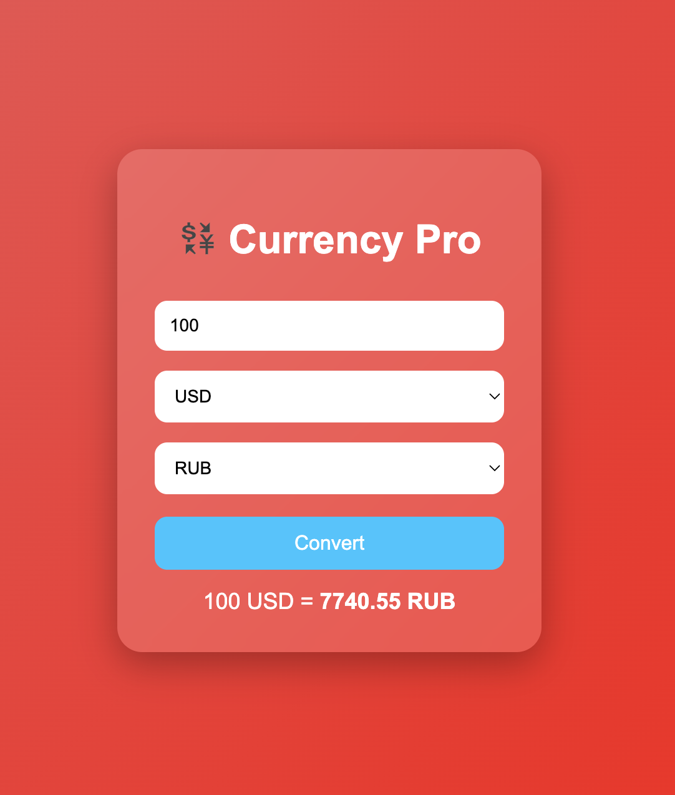

# 💱 Currency Converter

A modern currency converter built with HTML, CSS, and JavaScript.

## Features

- 🌍 Live exchange rates
- 💵 Convert between multiple currencies
- 🎨 Modern glassmorphism interface
- 📱 Responsive design
- ⚡ Fast and lightweight
- 🔗 Uses a public exchange rate API

## Technologies

- HTML5
- CSS3
- JavaScript (ES6)
- Exchange Rate API

## Preview



## Getting Started

1. Clone the repository:

```bash
git clone https://github.com/filonskiy3-spec/currency-converter.git
```

2. Open `index.html` in your browser.

## Author

Alexander Filonskiy
